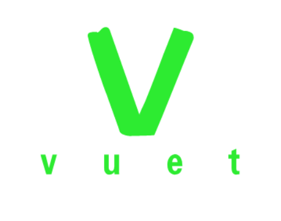

<p align="center"><a href="https://vuejs.org" target="_blank" rel="noopener noreferrer"></a></p>

<h2 align="center">Supporting Vue.js + typeScript</h2>

<h2 align="center">Introduction</h2>

Vuet CLI is the Standard Tooling for Vue.js Development
> You can use it to build a vue+ts spa or Multiple spas

<h2 align="center">Install</h2>


```bash
$ npm install vuet-cli -g
```
or

```bash
$ yarn global add vuet-cli
```

<h2 align="center">Usage</h2>

```bash
$ vut create <your-projectname>
```

<h2 align="center">feature</h2>

- 快速在本地构建一套开发环境
- webpack+vue+typescript(js)开发组合模式
- 支持css、less、sass、styl(us)
- 支持一个项目里集成多个独立的子项目 (vuet的特色)
- 支持热更新
- 支持h5适配


<h3 align="center">接下来要做的</h3>

- 独立子项目里支持多页
- 支持eslint
- 支持commit 规范
- chunk优化